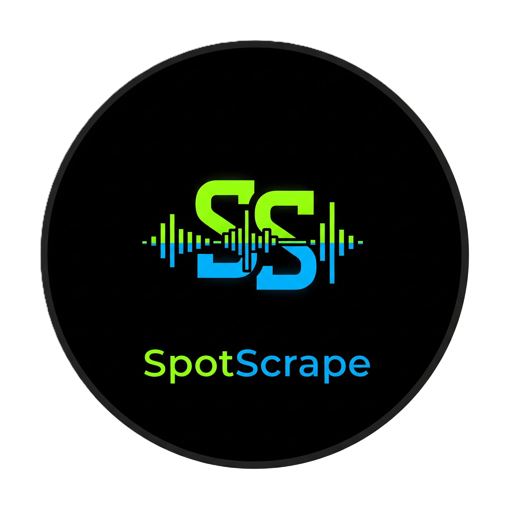

[](https://git.io/typing-svg)

A modern, fast, and responsive web application for extracting Spotify metadata without API keys. Built with Flask and featuring a sleek dark theme interface.



## ✨ Features

- **🚀 Lightning Fast**: Extract metadata in seconds without API setup
- **🔓 100% Free**: No hidden costs, no premium plans, unlimited extractions
- **📱 Mobile Ready**: Responsive design that works on all devices
- **🎵 Multi-Format Support**: Extract data from tracks, albums, artists, and playlists
- **📊 User Statistics**: Track your extraction history and statistics
- **🔐 User Authentication**: Secure sign-up/sign-in system with password recovery
- **🎬 YouTube Integration**: Find YouTube videos for extracted tracks
- **📥 Data Export**: Download extracted data as JSON files
- **🌙 Modern UI**: Beautiful dark theme with smooth animations

## 🛠️ Tech Stack

- **Backend**: Flask (Python)
- **Database**: SQLite with SQLAlchemy ORM
- **Frontend**: Bootstrap 5, HTML5, CSS3, JavaScript
- **Web Scraping**: BeautifulSoup4, Selenium WebDriver
- **Styling**: Custom CSS with modern glassmorphism effects

## 📋 Prerequisites

- Python 3.7 or higher
- Chrome browser (for Selenium WebDriver)
- Git (optional, for cloning)

## 🚀 Installation & Setup

### 1. Clone the Repository

```bash
git clone https://github.com/NikunjBaldaniya/SpotScrape.git
cd SpotScrape
```

### 2. Create Python Virtual Environment

#### On Windows:
```bash
# Create virtual environment
python -m venv spotscrape_env

# Activate virtual environment
spotscrape_env\Scripts\activate
```

#### On macOS/Linux:
```bash
# Create virtual environment
python3 -m venv spotscrape_env

# Activate virtual environment
source spotscrape_env/bin/activate
```

### 3. Install Dependencies

```bash
pip install -r requirements.txt
```

### 4. Run the Application

```bash
python app.py
```

The application will be available at `http://localhost:8000`

## 📁 Project Structure

```
SpotScrape/
├── app.py                          # Main Flask application
├── spotify_playlist_scraper.py     # Playlist scraping functionality
├── requirements.txt                # Python dependencies
├── README.md                      # Project documentation
├── instance/
│   └── database.db               # SQLite database (auto-created)
├── static/
│   ├── css/
│   │   ├── style.css            # Main stylesheet
│   │   └── modern-card.css      # Card component styles
│   ├── js/
│   │   └── script.js            # Frontend JavaScript
│   └── favicon.ico              # Application logo/favicon
└── templates/
    ├── base.html                # Base template
    ├── index.html               # Home page
    ├── playlist.html            # Playlist extraction page
    ├── history.html             # User history page
    ├── stats.html               # User statistics page
    ├── signin.html              # Sign in page
    ├── signup.html              # Sign up page
    ├── settings.html            # User settings page
    ├── forgot_password.html     # Password recovery page
    ├── about.html               # About page
    ├── faqs.html                # FAQ page
    └── privacy.html             # Privacy policy page
```

## 🎯 Usage

### Basic Data Extraction
1. Navigate to the home page
2. Paste any Spotify URL (track, album, artist, or playlist)
3. Click "Extract Data" to get metadata
4. View results with cover art, title, description, and links
5. Download data as JSON or open in Spotify/YouTube

### Playlist Scraping
1. Go to the "Playlists" page
2. Paste a Spotify playlist URL
3. The app will extract all tracks with details
4. View individual tracks with play buttons
5. Export complete playlist data

### User Features
- **Sign Up**: Create an account to save extraction history
- **History**: View your past 20 extractions
- **Statistics**: See your usage stats and activity
- **Settings**: Manage account preferences

## 🔧 Configuration

### Environment Variables
You can customize the following in `app.py`:

```python
app.config['SECRET_KEY'] = 'your-secret-key-here'  # Change for production
app.config['SQLALCHEMY_DATABASE_URI'] = 'sqlite:///database.db'
```

### Database Setup
The application automatically creates the SQLite database on first run. No manual setup required.

## 🌐 API Endpoints

### Public Endpoints
- `GET /` - Home page
- `GET /playlist` - Playlist extraction page
- `GET /about` - About page
- `GET /faqs` - FAQ page
- `GET /privacy` - Privacy policy

### Authentication Endpoints
- `POST /auth/signin` - User sign in
- `POST /auth/signup` - User registration
- `POST /auth/forgot-password` - Password recovery
- `GET /auth/signout` - Sign out

### Data Extraction Endpoints
- `POST /get-data` - Extract Spotify metadata
- `POST /scrape-playlist` - Extract playlist data
- `POST /download-json` - Download data as JSON
- `POST /get-youtube-url` - Get YouTube video URL

### User Data Endpoints
- `GET /history` - View extraction history
- `GET /stats` - View user statistics
- `DELETE /delete-history-item/<id>` - Delete history item
- `GET /clear-history` - Clear all history

## 🎨 Customization

### Themes
The app features a modern dark theme with Spotify-inspired colors:
- Primary: `#121212` (Dark background)
- Secondary: `#181818` (Card backgrounds)
- Accent: `#1DB954` (Spotify green)

### Logo Update
The app uses `static/favicon.ico` as the logo. To update:
1. Replace `static/favicon.ico` with your new logo
2. The logo is automatically used in the navigation bar

## 🔒 Security Features

- Password hashing with SHA-256
- Session-based authentication
- CSRF protection with Flask's secret key
- Input validation and sanitization
- SQL injection prevention with SQLAlchemy ORM

## ⚠️ Restrictions & Limitations

### User-Side Restrictions
- **Public Content Only**: Can only extract data from public Spotify content
- **No Private Playlists**: Private or restricted playlists cannot be accessed
- **Chrome Browser Required**: Playlist scraping requires Chrome browser with Selenium
- **Internet Connection**: All operations require active internet connection
- **Region Restrictions**: Some content may be region-locked or unavailable
- **History Limit**: Display limited to last 20 extractions (all data is stored)

### Technical Limitations
- **Large Playlists**: Playlists with 1000+ tracks may take longer to process
- **Rate Limiting**: While no hard limits exist, excessive requests may be throttled
- **YouTube Integration**: Depends on external YouTube API availability
- **Spotify Changes**: Service may be affected by Spotify's website structure changes
- **Browser Compatibility**: Full functionality requires modern browsers with JavaScript

### Owner-Side Considerations
- **Server Resources**: Large playlist scraping is resource-intensive
- **Chrome Driver**: Requires Chrome browser and ChromeDriver management
- **Database Growth**: User history and data storage grows over time
- **External Dependencies**: Relies on Spotify's public pages and YouTube API
- **Legal Compliance**: Must respect Spotify's terms of service and rate limits

## 🐛 Troubleshooting

### Common Issues

1. **Chrome Driver Issues**
   ```bash
   # The app automatically downloads ChromeDriver via webdriver-manager
   # Ensure Chrome browser is installed and updated
   ```

2. **Database Errors**
   ```bash
   # Delete the database file to reset
   rm instance/database.db
   # Restart the application to recreate tables
   ```

3. **Port Already in Use**
   ```bash
   # Change the port in app.py
   app.run(debug=True, host='0.0.0.0', port=8001)
   ```

4. **Extraction Failures**
   - Ensure the Spotify URL is public and accessible
   - Check if content is region-restricted
   - Verify internet connection is stable
   - Try refreshing the page and attempting again

5. **Playlist Scraping Issues**
   - Ensure Chrome browser is installed and updated
   - Check if playlist is public (private playlists cannot be scraped)
   - Large playlists may take several minutes to complete
   - Close other Chrome instances to free up resources

### Virtual Environment Issues

If you encounter issues with the virtual environment:

```bash
# Deactivate current environment
deactivate

# Remove existing environment
rm -rf spotscrape_env  # On Windows: rmdir /s spotscrape_env

# Create new environment
python -m venv spotscrape_env

# Activate and install dependencies
# Windows: spotscrape_env\Scripts\activate
# macOS/Linux: source spotscrape_env/bin/activate
pip install -r requirements.txt
```

## 📄 Usage Guidelines

### Acceptable Use
- Extract data for personal use and analysis
- Create backups of your own playlists
- Research and educational purposes
- Non-commercial data analysis

### Prohibited Activities
- Commercial redistribution of extracted data
- Bulk scraping for commercial purposes
- Violating Spotify's terms of service
- Overloading servers with excessive requests
- Sharing private or copyrighted content

### Best Practices
- Use reasonable request intervals
- Respect rate limits and server resources
- Report bugs and issues to improve the service
- Keep your Chrome browser updated for optimal performance

## 📝 License

This project is licensed under the MIT License - see the [LICENSE](LICENSE) file for details.

## 🤝 Contributing

1. Fork the repository
2. Create a feature branch (`git checkout -b feature/AmazingFeature`)
3. Commit your changes (`git commit -m 'Add some AmazingFeature'`)
4. Push to the branch (`git push origin feature/AmazingFeature`)
5. Open a Pull Request

## 📞 Support

If you encounter any issues or have questions:

1. Check the [FAQ page](http://localhost:8000/faqs) in the application
2. Review the troubleshooting section above
3. Create an issue on GitHub

## 🙏 Acknowledgments

- Spotify for the inspiration and design elements
- Bootstrap team for the responsive framework
- Flask community for the excellent documentation
- All contributors who help improve this project

---

**Made with ❤️ for music lovers**

*Note: This application is for educational purposes only. Please respect Spotify's terms of service and rate limits.*