# SpotScrape

SpotScrape is a small web app for getting music data from public Spotify links.

You can use it to:

- Read details about songs, albums, artists, playlists, and podcasts.
- Search the Spotify catalog by name.
- See song lists and podcast episode lists.
- Open Spotify and YouTube previews.
- Find synced or plain lyrics for songs.
- Download lyrics as `.lrc` or `.txt` files.
- Download result data as a JSON file.

The app does not need a user account or a database.

## What It Looks Like

### Home page

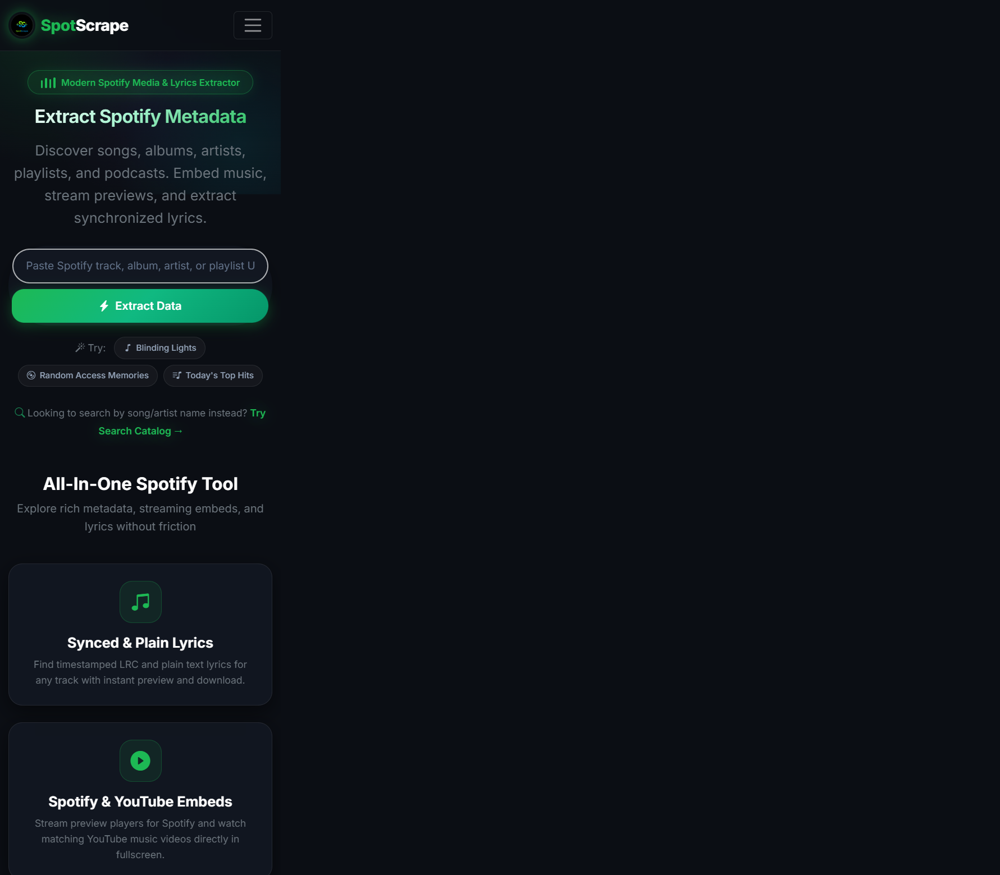

### Search results

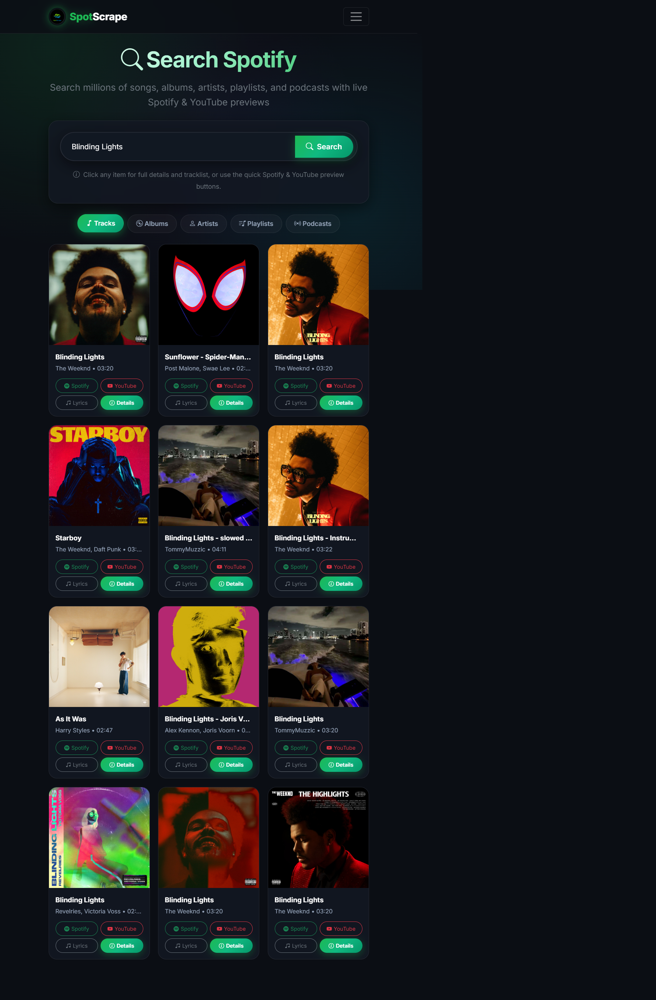

### Search result details

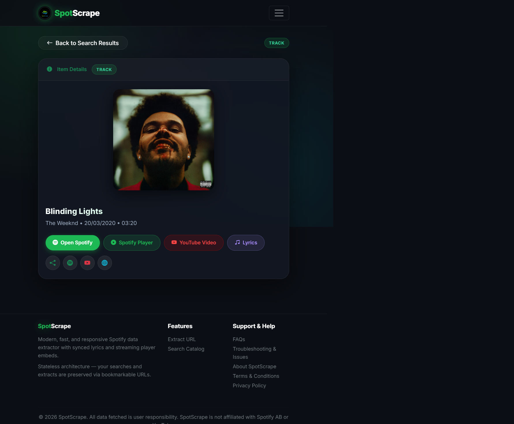

### Album data

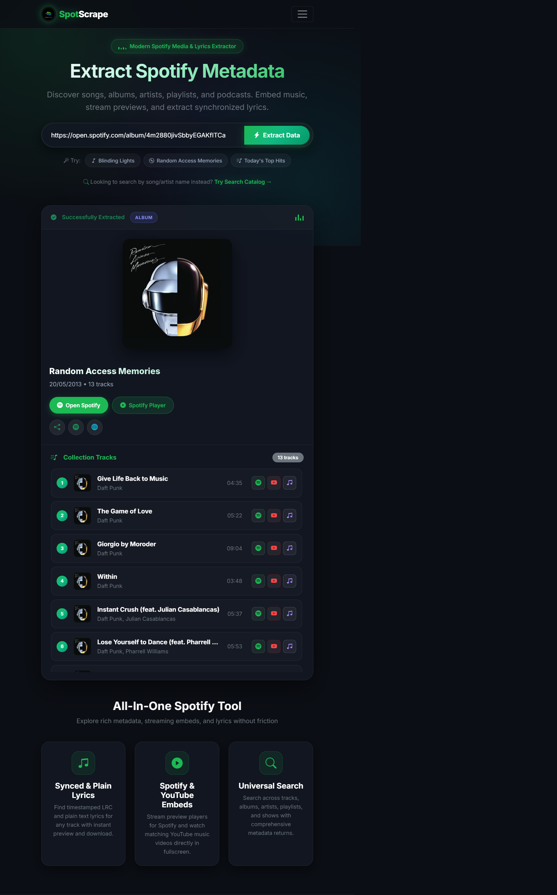

### Track data

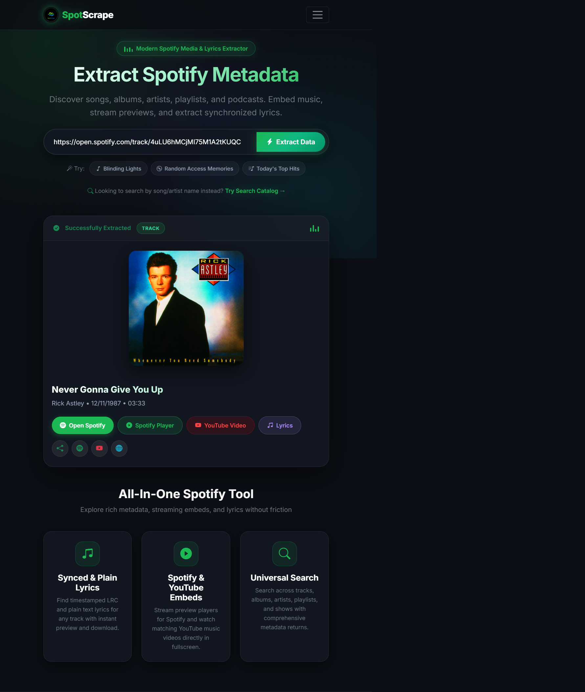

### Search by album

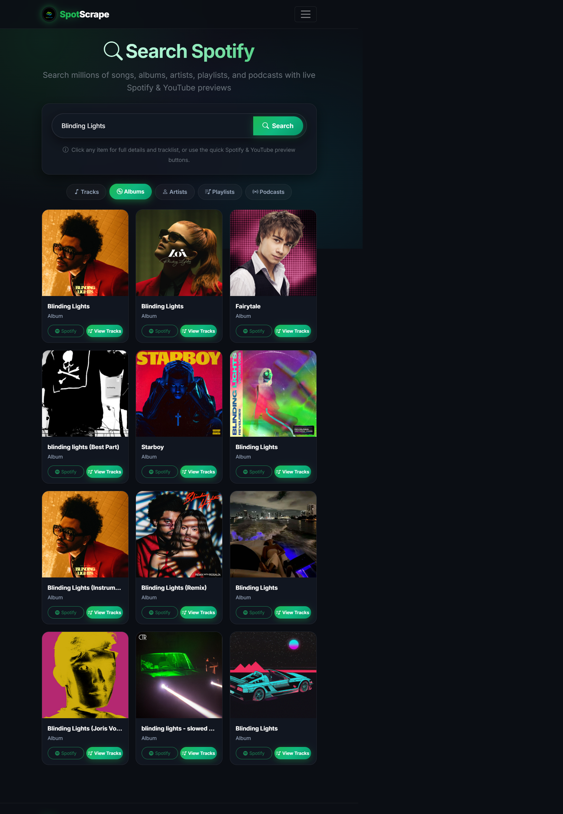

### Search by artist

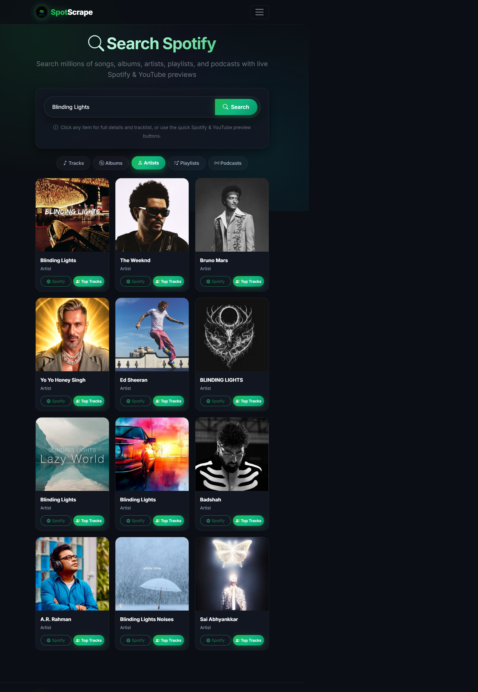

### Search by playlist

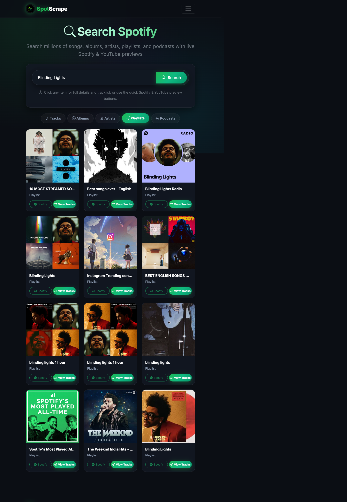

### Search by podcast

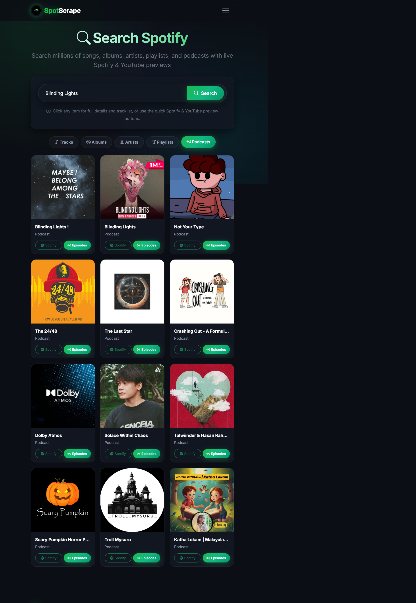

### About page

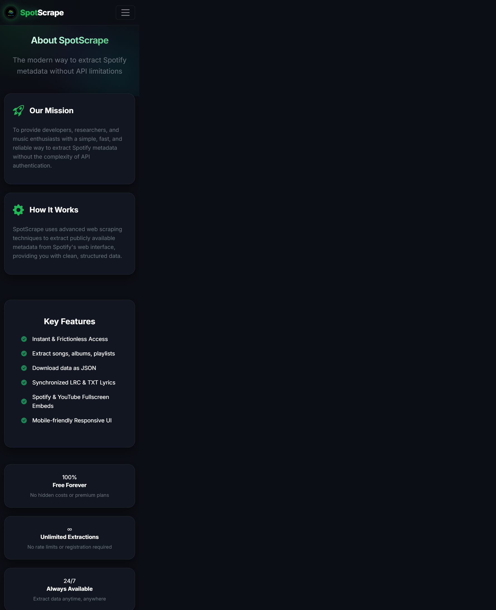

### FAQs page

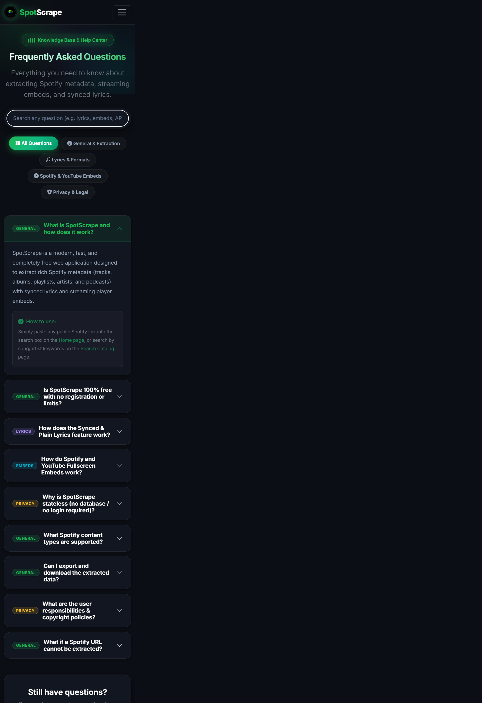

More tested screens are in the [screen_shorts](screen_shorts) folder.

## Main Tech

- **Python**: Runs the server and data work.
- **Flask**: Creates the web pages and API routes.
- **HTML and Jinja**: Builds the page content.
- **CSS**: Makes the pages look good and work on small screens.
- **JavaScript**: Handles search, loading screens, buttons, players, lyrics, and sharing.
- **Bootstrap 5**: Gives the app common page styles and layout tools.
- **Bootstrap Icons**: Gives the app its icons.
- **Spotify scraper**: Reads public Spotify data.
- **Syncedlyrics**: Finds song lyrics.
- **HTTPX and Requests**: Sends web requests.

Some page styles and icons are loaded from public CDN links in `templates/base.html`. An internet connection is needed for these links and for Spotify, YouTube, and lyrics data.

## Project Files

```text
SpotScrape/
|
|-- app.py                  Main Flask app and web routes
|-- spotify_extractor.py    Spotify data, search, lyrics, and save tools
|-- requirements.txt        Python packages used by the app
|-- static/
|   |-- css/
|   |   |-- style.css       Main page styles
|   |   `-- modern-card.css  Result card styles
|   `-- js/
|       `-- script.js       Search, extract, player, lyrics, and UI code
|-- templates/              HTML pages
|   |-- base.html           Shared header, footer, and popups
|   |-- index.html          Home and extract page
|   |-- search.html         Search page and detail page
|   |-- about.html          About page
|   |-- faqs.html           FAQ page
|   |-- privacy.html        Privacy page
|   |-- terms.html          Terms page
|   |-- issues.html         Help page template
|   `-- errors/             Error pages
`-- screen_shorts/          Screenshots made while testing
```

## Requirements

- Python 3.9 or newer is recommended.
- Internet access.
- A public Spotify link for extract work.
- A modern web browser.

## Install on Windows

Open PowerShell in the project folder:

```powershell
python -m venv .venv
.\.venv\Scripts\Activate.ps1
python -m pip install --upgrade pip
pip install -r requirements.txt
```

If PowerShell blocks the activate command, you can run the Python file without activating the environment:

```powershell
.\.venv\Scripts\python.exe app.py
```

## Install on macOS or Linux

```bash
python3 -m venv .venv
source .venv/bin/activate
python -m pip install --upgrade pip
pip install -r requirements.txt
```

## Start the App

With the virtual environment active, run:

```bash
python app.py
```

Open this address in your browser:

```text
http://127.0.0.1:8000
```

The server uses port `8000` by default. You can use another port with the `PORT` value:

### PowerShell

```powershell
$env:PORT=5000
python app.py
```

Then open `http://127.0.0.1:5000`.

## How to Use the Website

### Get data from a Spotify link

1. Open the home page.
2. Copy a public Spotify link.
3. Paste it into the large input box.
4. Press **Extract Data**.
5. Read the result card.
6. Use the Spotify, YouTube, Lyrics, Share, or JSON buttons.

The app can read links for:

- Tracks
- Albums
- Artists
- Playlists
- Shows
- Episodes

### Search for music

1. Open **Search** in the top menu.
2. Type a song, artist, album, playlist, or podcast name.
3. Press **Search**.
4. Use the tabs to view tracks, albums, artists, playlists, or podcasts.
5. Press **Details** or **View Tracks** on an item.

### Use lyrics

1. Search for a track or open a track result.
2. Press **Lyrics**.
3. Choose synced lyrics or plain text when both are available.
4. Copy the lyrics or download an `.lrc` or `.txt` file.

Lyrics may not be found for every song.

## Web Pages

| Page | Address | What it does |
| --- | --- | --- |
| Home | `/` | Extract data from a Spotify link |
| Search | `/search-page` | Search the Spotify catalog |
| Playlist | `/playlist` | Sends the user to the Search page |
| About | `/about` | Shows project information |
| FAQs | `/faqs` | Shows common questions and answers |
| Privacy | `/privacy` | Shows the privacy page |
| Terms | `/terms` | Shows terms and user rules |
| Health | `/health` or `/healthz` | Shows a small health JSON reply |

The `issues.html` file is present, but its Flask route is currently turned off in `app.py`. Visiting `/issues` therefore shows the 404 page.

## API Routes

These routes are used by the website JavaScript.

### Extract Spotify data

```text
POST /extract
```

Body:

```json
{
  "url": "https://open.spotify.com/track/4uLU6hMCjMI75M1A2tKUQC"
}
```

### Search Spotify

```text
POST /search
```

Body:

```json
{
  "query": "Blinding Lights"
}
```

### Find lyrics

```text
POST /lyrics
```

Body:

```json
{
  "title": "Blinding Lights",
  "artist": "The Weeknd"
}
```

### Download lyrics

```text
POST /lyrics/download
```

The page sends the lyrics, title, and format (`lrc` or `txt`) to this route.

### Find a YouTube link

```text
POST /get-yt-link-by-music-name
```

Body:

```json
{
  "music_name": "Blinding Lights by The Weeknd"
}
```

### Download JSON

```text
POST /download-json
```

This sends the current result back as `spotify_data.json`.

## Python Class Use

The main Python class is `SpotifyExtractor` in `spotify_extractor.py`.

```python
from spotify_extractor import SpotifyExtractor

extractor = SpotifyExtractor(fetch_youtube_links=False)

try:
    result = extractor.extract(
        "https://open.spotify.com/track/4uLU6hMCjMI75M1A2tKUQC"
    )
    print(result)
finally:
    extractor.close()
```

Search example:

```python
from spotify_extractor import SpotifyExtractor

with SpotifyExtractor(fetch_youtube_links=False) as extractor:
    result = extractor.search("daft punk", limit=5)
    print(result)
```

The class also has these useful methods:

- `extract(url)`
- `extract_track(url)`
- `extract_album(url)`
- `extract_artist(url)`
- `extract_playlist(url)`
- `extract_show(url)`
- `extract_episode(url)`
- `search(query, limit=10)`
- `extract_lyrics(song_name, artist_name)`
- `save_to_json(...)`
- `save_to_lrc(...)`
- `save_to_text(...)`

## YouTube Links

YouTube links are best guesses made from a YouTube search. They are not official Spotify links. A song may have no match, or the first match may not be the exact version wanted.

You can make extraction faster by turning this off:

```python
SpotifyExtractor(fetch_youtube_links=False)
```

## Limits and Simple Notes

- The app works best with public Spotify links.
- Private or blocked Spotify pages may not work.
- Spotify and YouTube can change their pages at any time.
- Lyrics are supplied by an outside lyrics service and may be missing or wrong.
- YouTube previews use an outside search request.
- Large playlists can take longer to load.
- The app has no login system and does not save a database.
- The app is for learning and personal use. Follow Spotify, YouTube, lyrics, and copyright rules.
- Do not use or share music data in a way that breaks local law or the rules of the source services.

## Health Check

After starting the app, open:

```text
http://127.0.0.1:8000/health
```

A working app returns JSON like this:

```json
{
  "status": "healthy",
  "service": "SpotScrape",
  "version": "1.0.0"
}
```

## Stop the App

Press `Ctrl+C` in the terminal where the app is running.

## License

No license file is included in this project yet. Add a license before sharing the project as open source.
